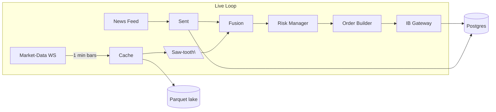

# PriceWhisperer

*A real-time options-trading engine that listens for “whispers” in minute-bar price action and headlines, then monetises the noise with the right option strategy.*

---

<p align="center">
  
</p>

---

## Elevator pitches

### 15-second teaser

> “PriceWhisperer spots micro-oscillations and headline shocks in real time, then auto-fires the option spread that best monetises that volatility, all tested in IBKR’s paper market.”

---

### 30-second corridor version

> “We’re building *PriceWhisperer*, an engine that listens to every listed stock, tags the ‘saw-tooth’ reversals you see on intraday charts, overlays live sentiment, and instantly decides whether to sell premium, buy gamma or fade a gap.
> The α-milestone is live: data lake, signal logic, and automated options orders already run end-to-end in Interactive Brokers’ paper account. Next step—turn it loose on small real money and start compounding the edge.”

---

### 2-minute investor pitch

> “Equity markets have splintered into two extremes: ultra-high-frequency firms clipping micro-spreads and retail momentum chasers pushing price into predictable saw-tooth patterns.
> **PriceWhisperer** lives in the middle.
>
> * How it works:
    >
    >   1. **Stream & store** minute-level trades, option chains and news headlines into a Parquet lake—cheap and query-ready.
    >   2. **Detect** micro-patterns—oscillations, regime breaks, gaps—via an engine that flags only moves bigger than 1.2 × ATR but smaller than classic trend systems even notice.
    >   3. **Fuse** that with real-time sentiment so we know if a spike is data-driven or pure order-flow.
>   4. **Exploit** via the option Greeks best suited to the pattern: sell defined-risk condors when range-bound, buy strangles when IV is mis-priced, or gamma-scalp straddles when realised vol outruns implied.
> * Why it’s credible: same codebase already back-tests off months of Parquet history **and** executes live—today—in Interactive Brokers’ sandbox, with latency <1 ms inside one laptop.
> * Path to money: flip the switch to a funded IBKR account, size trades conservatively, and iterate; then scale capital once live Sharpe > 1.5 is demonstrated over 90 days.
    >   **Bottom line:** we’re not predicting the future—we’re arbitraging micro-behaviour everyone can see but few can automate at the options-level. The infrastructure is live; we’re ready for real capital.”


## ✨ Key features at Milestone #1

| Component          | Status                                                                                                   | Highlights                                     |
| ------------------ | -------------------------------------------------------------------------------------------------------- | ---------------------------------------------- |
| **Data ingestion** | ✅ Live minute bars & option greeks (Polygon / IBKR) streamed into in-memory cache & archived as Parquet. | `tungstenite`, `polars`, `zstd` compression    |
| **Pattern engine** | ✅ Rust saw-tooth detector + gap/regime switch & FinBERT sentiment fusion.                                | windowed peak/trough; ATR filter; news overlay |
| **Trade logic**    | ✅ Condor, strangle & gamma-scalp playbook wired to signals.                                              | dynamic sizing, auto-hedge rules               |
| **Execution**      | ✅ End-to-end on Interactive Brokers **paper** gateway (identical API to live).                           | `ibkr-rust`, 50 msg/s limit-aware              |
| **Risk & logging** | ✅ Real-time theta/delta caps; orders & fills persisted in Postgres, prices in DuckDB lake.               | Prometheus metrics, Grafana dashboard          |

> **Definition of Done:** 24-hour unattended paper run with zero runtime exceptions and a complete trade ledger.

---

## 🏗️  Architecture at a glance



*One code-path drives both live trading and historical back-tests.*

---

## 🚀  Quick start

```bash
# 1 clone & build
$ git clone https://github.com/your-org/pricewhisperer.git
$ cd pricewhisperer && cargo build --release

# 2 start the IB Gateway in paper mode (port 7497)
# 3 run the bot
$ cargo run --release -- \  
      --config examples/ibkr_paper.toml
```

> **Requirements:** Rust 1.73+, PostgreSQL 14+, DuckDB 0.10+, an IBKR account with market-data subscriptions.

---

## 🗄️  Repo structure

```
pricewhisperer/
 ├── crates/
 │   ├── core/           # saw-tooth & sentiment fusion
 │   ├── broker_ib/      # IBKR socket + REST bindings
 │   ├── strategies/     # condor, strangle, gamma-scalp modules
 │   └── storage/        # Parquet + Postgres helpers
 ├── config/             # .toml samples
 ├── docs/               # design notes & logo
 └── README.md
```

---

## 🛣️  Roadmap

1. **Milestone #2 – Live-money pilot**
   • Switch to small funded account, confirm real-fill slippage < 0.15 × premium.
   • Add dynamic IV filtering and skew checks.
2. **Milestone #3 – Multi-asset scaling**
   • Extend to SPX 0-DTE and crypto options (Deribit).
   • Introduce Redis pub-sub for cluster deployment.
3. **Milestone #4 – Reinforcement learner overlay**
   • Live policy gradient agent to weight strategy selection.

---

## 📜  License

Apache 2.0 — free for personal & commercial use with attribution.

---

### 👥  Contributors

*Core dev:* `@casibbald`
*Quant research:* `@quant-friends`

*We welcome PRs & issues!*
