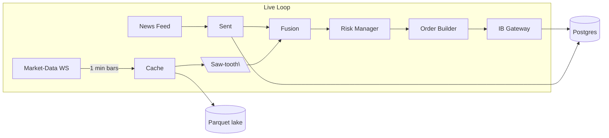
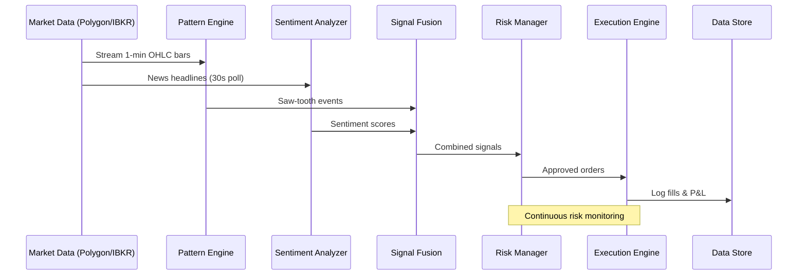

# PriceWhisperer

*A real-time options-trading engine that listens for "whispers" in minute-bar price action and headlines, then monetises the noise with the right option strategy.*

---

<p align="center">
  
</p>

---

## 🎯 Project Overview

PriceWhisperer is an automated options trading system that bridges the gap between ultra-high-frequency trading (microsecond level) and retail momentum trading. By detecting and exploiting minute-level micro-patterns combined with real-time sentiment analysis, it aims to arbitrage market behaviors that are visible but difficult to automate at the options level.

### Core Value Proposition
- **Target Market**: The "middle ground" between HFT firms and retail traders
- **Edge**: Micro-patterns too small for trend-following systems, too slow for ultra-HFT
- **Timeframe**: Minute-bar resolution (not microsecond, not daily)
- **Risk Management**: Defined-risk strategies with automated position sizing
- **Success Metric**: Sharpe ratio > 1.5 over 90 days

---

## Elevator pitches

### 15-second teaser

> “PriceWhisperer spots micro-oscillations and headline shocks in real time, then auto-fires the option spread that best monetises that volatility, all tested in IBKR’s paper market.”

---

### 30-second corridor version

> “We’re building *PriceWhisperer*, an engine that listens to every listed stock, tags the ‘saw-tooth’ reversals you see on intraday charts, overlays live sentiment, and instantly decides whether to sell premium, buy gamma or fade a gap.
> The α-milestone is live: data lake, signal logic, and automated options orders already run end-to-end in Interactive Brokers’ paper account. Next step—turn it loose on small real money and start compounding the edge.”

---

### 2-minute investor pitch

> “Equity markets have splintered into two extremes: ultra-high-frequency firms clipping micro-spreads and retail momentum chasers pushing price into predictable saw-tooth patterns.
> **PriceWhisperer** lives in the middle.
>
> **How it works:**
>
>  1. **Stream & store** minute-level trades, option chains and news headlines into a Parquet lake—cheap and query-ready.
>  2. **Detect** micro-patterns—oscillations, regime breaks, gaps—via an engine that flags only moves bigger than 1.2 × ATR but smaller than classic trend systems even notice.
>  3. **Fuse** that with real-time sentiment so we know if a spike is data-driven or pure order-flow.
>  4. **Exploit** via the option Greeks best suited to the pattern: sell defined-risk condors when range-bound, buy strangles when IV is mis-priced, or gamma-scalp straddles when realised vol outruns implied.
>
> * Why it’s credible: build a codebase that back-tests off months of Parquet history **and** executes live—today—in Interactive Brokers’ sandbox, with latency <1 ms inside one laptop.
> * Path to money: flip the switch to a funded IBKR account, size trades conservatively, and iterate; then scale capital once live Sharpe > 1.5 is demonstrated over 90 days.
>   **Bottom line:** we’re not predicting the future—we’re arbitraging micro-behaviour everyone can see but few can automate at the options-level. The infrastructure is live; we’re ready for real capital.”


## 🔍 Trading Patterns & Strategies

### Detected Patterns
1. **Saw-tooth Reversals** - Micro-oscillations in intraday charts (peaks/troughs within 5-bar windows)
2. **Gap Movements** - Significant price jumps (≥7% from previous close)
3. **Sentiment Shifts** - News-driven price movements correlated with FinBERT scores

### Options Strategy Playbook

| Market Condition | Pattern Signal | Strategy | Purpose |
|-----------------|---------------|----------|---------|
| **Range-bound oscillation** | Saw-tooth + neutral sentiment | Iron Condor | Sell premium, collect theta |
| **Directional breakout** | Gap + bullish/bearish sentiment | Long Call/Put | Capture directional moves |
| **Volatility expansion** | High sentiment score + price spike | Long Strangle | Profit from volatility |
| **Realized > Implied vol** | Consistent saw-tooth amplitude | Gamma Scalping | Harvest micro-movements |
| **Portfolio protection** | Market uncertainty signals | Protective Puts | Hedge downside risk |

---

## ✨ Key features targeted for Milestone #1

| Component          | Status | Implementation Details | Technical Stack |
| ------------------ |--------|------------------------|-----------------|
| **Data ingestion** | 🚧 Planning | • Live minute bars via WebSocket<br>• Option chain snapshots every 5 min<br>• News feed polling every 30s<br>• Parquet archival for replay | `tungstenite`, `polars`, `tokio`, `zstd` |
| **Pattern engine** | 🚧 Planning | • Sliding 5-bar window analysis<br>• ATR(14) amplitude filter (≥1.2x)<br>• Peak/trough state machine<br>• Gap detection (≥7% moves) | Custom Rust algorithms, `ta` crate |
| **Sentiment analysis** | 🚧 Planning | • Real-time headline ingestion<br>• FinBERT ONNX inference<br>• Score range: -1.0 to +1.0<br>• 30-min correlation window | `onnxruntime`, `reqwest` |
| **Signal fusion** | 🚧 Planning | • Join price events with sentiment<br>• Weight calculation<br>• Signal quality scoring<br>• Rate limiting (max 10 signals/min) | Rust async channels |
| **Trade logic** | 🚧 Planning | • Strategy selection matrix<br>• Position sizing ($300 risk limit)<br>• Greeks calculation<br>• Order generation | Strategy pattern, `DashMap` cache |
| **Risk management** | 🚧 Planning | • Portfolio theta cap: -$1,000<br>• Delta limits: ±$10,000<br>• Max positions: 10<br>• Auto-hedge triggers | In-memory state tracking |
| **Execution** | 🚧 Planning | • IBKR paper gateway integration<br>• Order lifecycle management<br>• Fill tracking<br>• 50 msg/s rate limiting | `ibkr-rust`, async/await |
| **Data persistence** | 🚧 Planning | • PostgreSQL for trades/fills<br>• Parquet lake for price history<br>• DuckDB for analytics<br>• Redis for real-time state | `sqlx`, `arrow`, `redis-rs` |
| **Observability** | 🚧 Planning | • Prometheus metrics export<br>• Grafana dashboards<br>• Latency histograms<br>• P&L tracking | `prometheus`, `tracing` |

> **Definition of Done:** 24-hour unattended paper run with zero runtime exceptions and a complete trade ledger.

---

## 🏗️  Architecture at a glance

### System Architecture



*One code-path drives both live trading and historical back-tests.*

### Data Flow & Processing Pipeline



### Key Technical Decisions

| Aspect | Choice | Rationale |
|--------|--------|-----------|
| **Language** | Rust | Performance, safety, low-latency execution |
| **Data Format** | Parquet | Columnar storage, compression, fast queries |
| **Time Resolution** | 1-minute bars | Balance between signal quality and execution cost |
| **ML Framework** | ONNX Runtime | Fast inference, language agnostic models |
| **Message Queue** | Async channels + Redis | Low latency internal, persistent external |
| **Backtesting** | Same codebase | Ensures strategy validity, reduces bugs |

---

## 🚀  Quick start

```bash
# 1 clone & build
$ git clone https://github.com/your-org/pricewhisperer.git
$ cd pricewhisperer && cargo build --release

# 2 start the IB Gateway in paper mode (port 7497)
# 3 run the bot
$ cargo run --release -- \  
      --config examples/ibkr_paper.toml
```

> **Requirements:** Rust 1.73+, PostgreSQL 14+, DuckDB 0.10+, an IBKR account with market-data subscriptions.

---

## 🗄️  Repo structure

```
pricewhisperer/
 ├── crates/                    # Rust workspace members
 │   ├── core/                  # Pattern detection & sentiment fusion
 │   │   ├── patterns/          # Saw-tooth, gap, regime detectors
 │   │   ├── sentiment/         # FinBERT integration
 │   │   └── fusion/            # Signal combination logic
 │   ├── broker_ib/             # IBKR integration
 │   │   ├── gateway/           # Socket protocol implementation
 │   │   ├── rest/              # REST API bindings
 │   │   └── types/             # Order/fill type definitions
 │   ├── strategies/            # Options strategy modules
 │   │   ├── condor/            # Iron condor implementation
 │   │   ├── strangle/          # Long strangle logic
 │   │   ├── straddle/          # Gamma scalping module
 │   │   └── selection/         # Strategy selection matrix
 │   └── storage/               # Data persistence layer
 │       ├── parquet/           # Time-series archival
 │       ├── postgres/          # Trade ledger
 │       └── cache/             # Redis/in-memory state
 ├── config/                    # Configuration files
 │   ├── ibkr_paper.toml        # Paper trading config
 │   ├── backtest.toml          # Backtesting parameters
 │   └── production.toml        # Live trading settings
 ├── docs/                      # Documentation
 │   ├── whitepapers/           # Strategy deep-dives
 │   ├── milestones/            # Development targets
 │   └── scenarios/             # Test scenarios
 ├── tasks/                     # Development tasks
 └── README.md                  # This file
```

---

## 🛣️  Roadmap

### Current Phase: Pre-Implementation
- 📝 System design and architecture documentation
- 🎯 Strategy validation and backtesting framework design
- 🔧 Development environment setup

### Milestone #1 – Paper Trading Alpha (Current Target)
- ✅ Complete system architecture design
- 🚧 Implement core Rust components
- 🚧 Integrate with IBKR paper trading
- 🚧 Deploy monitoring infrastructure
- **Success Criteria**: 24-hour unattended paper run with zero exceptions

### Milestone #2 – Live Money Pilot
- Switch to small funded account ($5,000-$10,000)
- Confirm real-fill slippage < 0.15 × premium
- Add dynamic IV filtering and skew checks
- Implement advanced risk controls
- **Success Criteria**: 30 days profitable trading with Sharpe > 1.0

### Milestone #3 – Multi-Asset Scaling
- Extend to SPX 0-DTE options (highest liquidity)
- Add crypto options support (Deribit integration)
- Introduce Redis pub-sub for cluster deployment
- Scale to monitor 100+ symbols simultaneously
- **Success Criteria**: Handle 1,000+ signals/day across multiple markets

### Milestone #4 – ML Enhancement
- Deploy reinforcement learning for strategy selection
- Implement online learning from trade outcomes
- Add deep learning for pattern recognition
- **Success Criteria**: 20% improvement in Sharpe ratio vs rule-based system

---

## ⚠️  Risk Considerations

### Market Risks
- **Spread Costs**: Wide bid-ask spreads can erode profits on frequent trading
- **Slippage**: Difference between expected and actual fill prices
- **Competition**: HFT firms and market makers compete for same edges
- **Black Swan Events**: Unexpected market events outside normal patterns

### Technical Risks
- **Latency**: Network delays can impact execution quality
- **System Failures**: Hardware/software failures during market hours
- **Data Quality**: Bad ticks or delayed feeds can trigger false signals
- **Over-optimization**: Backtesting bias leading to poor live performance

### Regulatory Considerations
- **Pattern Day Trading**: SEC rules require $25,000 minimum for frequent trading
- **Market Manipulation**: Ensure compliance with trading regulations
- **Tax Implications**: Short-term trading generates ordinary income tax

---

## 📊  Performance Metrics

### Key Performance Indicators (KPIs)
- **Sharpe Ratio**: Target > 1.5 (risk-adjusted returns)
- **Win Rate**: Target > 55% after costs
- **Average Trade Duration**: 15-120 minutes
- **Max Drawdown**: < 15% of capital
- **Daily P&L Volatility**: < 2% of capital

### Monitoring Dashboard
- Real-time P&L tracking
- Position Greeks exposure
- Signal quality metrics
- Execution performance stats
- Risk limit utilization

---

## 🔧  Development Setup

### Prerequisites
```bash
# Install Rust
curl --proto '=https' --tlsv1.2 -sSf https://sh.rustup.rs | sh

# Install PostgreSQL
brew install postgresql  # macOS
# or
sudo apt-get install postgresql  # Ubuntu

# Install DuckDB
brew install duckdb  # macOS
# or download from https://duckdb.org

# Set up IBKR Gateway
# Download from https://www.interactivebrokers.com
```

### Environment Configuration
```bash
# Clone repository
git clone https://github.com/your-org/pricewhisperer.git
cd pricewhisperer

# Copy sample config
cp config/ibkr_paper.toml.example config/ibkr_paper.toml

# Edit with your IBKR credentials
vim config/ibkr_paper.toml

# Run tests
cargo test

# Start paper trading
cargo run --release -- --config config/ibkr_paper.toml
```

---

## 📚  Documentation

- [Saw-tooth Pattern Detection](docs/whitepapers/saw_tooth.md) - Core pattern recognition algorithm
- [Options Strategy Selection](docs/whitepapers/straddle.md) - When to use each strategy
- [System Architecture](docs/whitepapers/decision_loop.md) - Detailed component interactions
- [Development Tasks](tasks/stories_for_github.md) - Breakdown of implementation work

---

## 📜  License

Apache 2.0 — free for personal & commercial use with attribution.

---

## 👥  Contributors

- **Core Development**: `@casibbald`
- **Quantitative Research**: `@quant-friends`
- **Strategy Design**: Open for contributions

### How to Contribute
1. Fork the repository
2. Create a feature branch (`git checkout -b feature/amazing-feature`)
3. Commit your changes (`git commit -m 'Add amazing feature'`)
4. Push to the branch (`git push origin feature/amazing-feature`)
5. Open a Pull Request

*We welcome PRs, issues, and strategy suggestions!*

---

## 🙏  Acknowledgments

- Interactive Brokers for comprehensive API access
- Polygon.io for reliable market data feeds
- The Rust community for excellent async/financial crates
- FinBERT team for pre-trained sentiment models

---

> **Disclaimer**: This software is for educational purposes, and you will lose your money if connected to a life trading account!.
>  Trading options involves substantial risk of loss and is not suitable for all investors. 
> Past performance does not guarantee future results. Always do your own research and consider consulting with a financial advisor.
