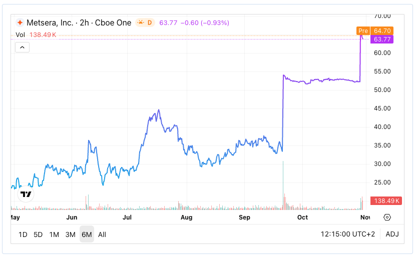
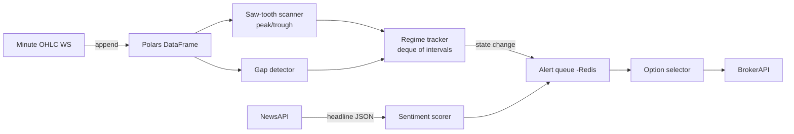

### What the chart is really telling us

| Visual cue on the 6-month chart                                                                                                | Objective description                                                                        | Typical root-cause                                             |
| ------------------------------------------------------------------------------------------------------------------------------ | -------------------------------------------------------------------------------------------- | -------------------------------------------------------------- |
| **Short-period saw-tooth May → July** – three clear rallies (+8 – 12 %) followed by retracements – all inside a rising channel | Mean-reversion swings every **4-7 trading days**, amplitude ≈ **1.5 × ATR(14)**, volume mild | Momentum algos, retail flow, no major headlines                |
| **Mid-July spike to $42** then fade                                                                                            | One bar with **>3× normal volume**, price gaps 6 % intraday                                  | Earnings beat or bullish broker initiation                     |
| **Early-Oct 40 → 55 gap** (violet plot)                                                                                        | **25 % overnight gap** on 25-× volume; prints a new regime with low intra-bar variance       | *Hard catalyst* – FDA letter, takeover, new listing tier       |
| **31 Oct pre-market pop 55 → 64**                                                                                              | Second **>15 % gap** in <30 days; liquidity still thin (β=2)                                 | Follow-up catalyst, e.g., Phase-II top-line or index inclusion |

Those three **catalyst-driven discontinuities** eclipse the earlier saw-teeth.  Your engine must therefore:

1. **Separate “normal” oscillations** (useful for gamma-scalping or iron-condor fades)
2. **Detect regime breaks** (switch from range-trading to breakout / gap logic)
3. **Pull headline sentiment** to see if the gap is data-validated or just sympathy flow

---

### How to codify the pattern for the bot

| Detection step (minute bars) | Concrete rule                                                                                                                                                  |                      |                                                                                                                            |
| ---------------------------- | -------------------------------------------------------------------------------------------------------------------------------------------------------------- | -------------------- | -------------------------------------------------------------------------------------------------------------------------- |
| **a. Saw-tooth flag**        | *Peak* if `close_i` is the max of a ±M-bar window **and** `(peak-prev_trough) ≥ 1.2 × ATR(N)`. *Trough* mirror logic.  Typical `M=5`, `N=14` on 1-min bars. |                      |                                                                                                                            |
| **b. Periodicity check**     | Maintain deque of last 5 peak→peak intervals.  If `σ(intervals) < 0.25 × mean` → mark “stable oscillation regime”.                                             |                      |                                                                                                                            |
| **c. Gap/breakout override** | If `                                                                                                                                                           | open_t – close_{t-1} | / close_{t-1} ≥ 7 %`**OR**`vol_t ≥ 5 × medianVol` → set regime = “gap”; suspend saw-tooth trades until realised σ reverts. |
| **d. News correlation**      | Within ±30 min of a gap flag, hit sentiment API. • Pos score > +0.5 → long-bias list. • Neg < −0.5 → short-bias. • No news → tag “technical only”.    |                      |                                                                                                                            |
| **e. Alert queue**           | Push ticker, regime, sentiment into Redis list watched by option-selector.                                                                                     |                      |                                                                                                                            |

*Parameter shorthand: ATR = average true range; σ = standard deviation.*

---

### Where your options tactics fit

| Regime                      | Option tactic                                                                     | Rationale                                                                   |
| --------------------------- | --------------------------------------------------------------------------------- | --------------------------------------------------------------------------- |
| **Stable oscillation**      | Short iron-condor or long-gamma scalp (buy ATM straddle, hedge delta each bounce) | Price stays inside ±1–1.5 × ATR channel; theta income or gamma harvest.     |
| **Gap / breakout**          | Long OTM *strangle* or single-leg call/put                                        | Directional burst likely > implied; buying wings cheaper than ATM straddle. |
| **Technical gap / no news** | Fade the move with 0-DTE credit spread after reversal confirmation                | Many “no-headline” gaps retrace 30–50 % intraday.                           |

---

### Implementation quick-map in Rust

* The **saw-tooth scanner** emits events only if not in “gap” state.
* **Gap detector** has higher priority; it flushes pending oscillation trades.

---

### Why this is feasible

* Minute bars and Reddit/Bloomberg headlines are cheap and low-latency.
* Gap-override prevents the system from bleeding when volatility regime flips (as in your chart).
* The same logic generalises to any ticker universe IBKR streams.

> **Bottom line:** the pattern you showed is perfect training data: early months = oscillation strategy, but once the volume spike + 20 % gap hits, the bot must switch to breakout rules.  Encapsulate that state machine and your option engine can farm both sides of the behaviour.
