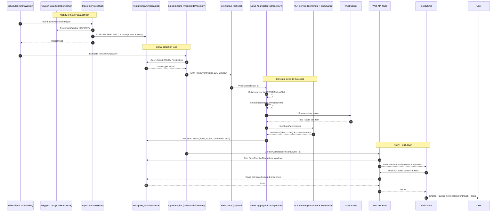
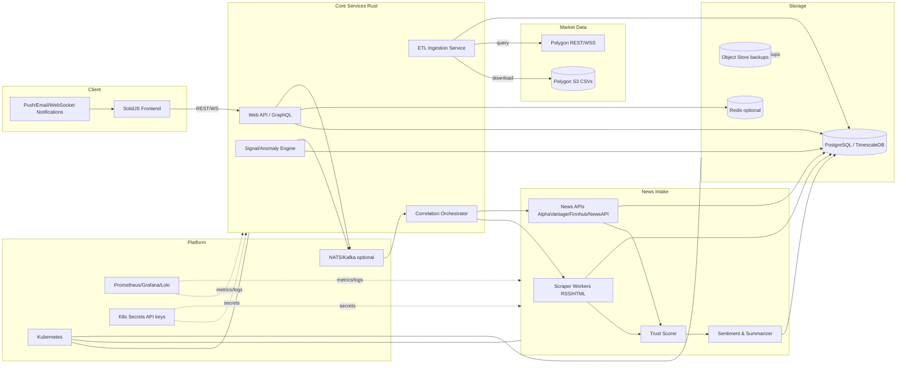
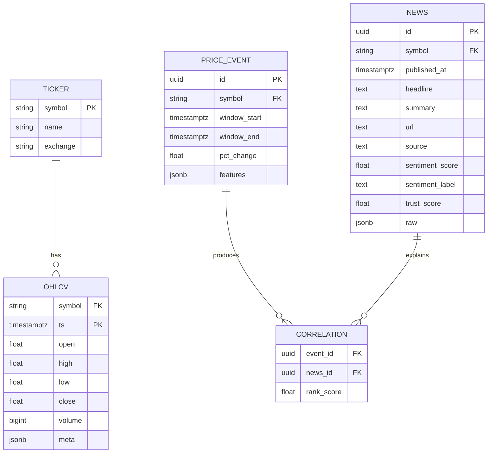

# Polygon Analytics Platform — Architecture Diagrams (v2: Price↔News Correlation)

This version adds end‑to‑end sequencing for: price change detection → news collection → trust & sentiment triage → correlation → notification. It also expands the component graph to include scraping/APIs, NLP, and alerting.

---

## 1) End‑to‑End Sequence (Daily/Hourly Trigger → User Review)




---

## 2) System Component Graph (with News Correlation)


---

## 3) Data Model (Concise ER Sketch)


---

### Notes & Options
- **Trust Scoring:** simple whitelist → weighted score; enrich later with domain reputation signals.
- **Sentiment:** start with headline‑only; upgrade to FinBERT or vendor‑provided scores when using APIs.
- **Scheduling:** K8s CronJobs for EOD/hourly; MQ (NATS/Kafka) if you want decoupled fan‑out.
- **Performance:** index `(symbol, ts)` on OHLCV/NEWS; consider Timescale continuous aggregates; batch UPSERTs.
- **Security:** respect robots.txt for scrapers; rotate API keys via K8s Secrets.

```
