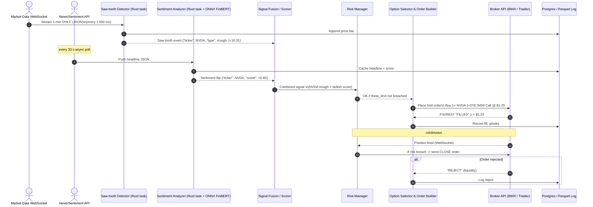

Here’s a high-level **sequence diagram** (Mermaid) showing all actors, the minute-bar cadence, and the decision loop from raw ticks to an executed options trade.

### Component notes

| Component              | Crates / Tech                                                                        | Key jobs                                                  |
| ---------------------- | ------------------------------------------------------------------------------------ | --------------------------------------------------------- |
| **Market-Data WS**     | `tungstenite`, `tokio`                                                               | Subscribe to `A.T.NVDA` minute bars (Polygon or IBKR).    |
| **Saw-tooth Detector** | `polars` + custom algo                                                               | Slide 5-bar window; flag `Peak`/`Trough`.                 |
| **Sentiment Analyzer** | `reqwest` + `onnxruntime`                                                            | Pull headline → FinBERT score → emit +/- flip.            |
| **Signal Fusion**      | simple Rust actor                                                                    | Join events by ticker/time; weight saw-tooth & sentiment. |
| **Risk Manager**       | in-mem store + periodic broker positions query                                       | Track net theta, delta, cash; gate orders.                |
| **Option Selector**    | pulls freshest chain via broker REST; chooses nearest ATM, 0-DTE; builds JSON order. |                                                           |
| **Broker API**         | IBKR socket or Tradier REST; async order / execution streams.                        |                                                           |
| **Data store**         | Postgres for fills & PnL; Parquet for price history.                                 |                                                           |

*All arrows above are **JSON messages** over WebSocket or internal async channels; every event also persists to the DB so you can replay.*

You can copy-paste the Mermaid block into any diagram-rendering tool (Mermaid Live, Obsidian, GitHub) to visualise it. Let me know if you’d like code templates for any of the labeled modules.
