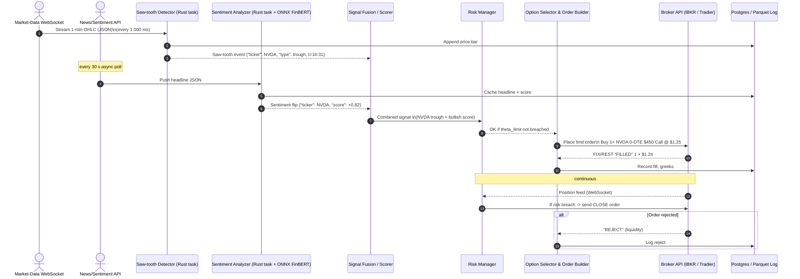

### Feasibility snapshot

| Dimension                      | Practical reality today                                                                                                                                                                                           |
| ------------------------------ | ----------------------------------------------------------------------------------------------------------------------------------------------------------------------------------------------------------------- |
| **Market-data latency needed** | Minute bars are trivial to stream from inexpensive vendors (Polygon, Intrinio, Tiingo, IEX Cloud).  Even Interactive Brokers’ own `reqMktData` can push 250 ms snapshots—plenty for a minute-bar engine.          |
| **Options availability**       | U.S. equity options are the deepest, most API-friendly universe.  0-DTE contracts now trade >3 million lots/day on SPX/SPY, QQQ, TSLA, NVDA—ideal for “micro” call/put flips.                                     |
| **Broker APIs**                | IBKR, Tradier, Tastytrade, Deribit (crypto), and (in beta) Alpaca **all expose options REST/WebSocket** endpoints with retail–friendly account minimums.                                                          |
| **Rust ecosystem**             | Crates exist for: WebSockets (`tungstenite`), REST (`reqwest`), fast dataframes (`polars`), technical analysis (`ta`), ML inference (`onnxruntime`), Python bridge (`pyo3`)—so a pure-Rust stack is fully doable. |
| **Competition**                | Plenty: from retail Discord bots that scalp SPX 0-DTE to professional HFT desks (Citadel, IMC) running volatility micro-arbitrage.  Edge must come from your **signal quality + execution cost control**.         |

---

## 1️⃣  API / data building blocks (Rust-compatible)

| Layer                          | Vendor / Open source                                                                                                                            | What you get                                                             | Rust-specific note                                                                              |
| ------------------------------ | ----------------------------------------------------------------------------------------------------------------------------------------------- | ------------------------------------------------------------------------ | ----------------------------------------------------------------------------------------------- |
| **Broker execution (options)** | **Interactive Brokers** TWS / IB-Gateway (socket protocol) <br>Tradier REST & streaming <br>Tastytrade REST <br>Deribit REST/WebSocket (crypto) | Order routing for stock + option legs; margin; OCO; portfolio readbacks. | `ibkr-rust` community crate, or raw TWS socket via `tokio`.  REST endpoints easy via `reqwest`. |
| **Live prices (minute bars)**  | Polygon.io WebSocket <br>Intrinio real-time <br>IEX Cloud SSE <br>IBKR market-data feed (if you have the pro bundle)                            | Trades/quotes, greeks, vol surfaces.                                     | All stream JSON ↔ WebSocket → `tungstenite` or `async-tungstenite`.                             |
| **News / sentiment**           | Benzinga Cloud <br>Finnhub <br>RavenPack (RSS + WebSocket) <br>Twitter/X API, Reddit Pushshift                                                  | JSON payloads with headline, sentiment score (or tweet text).            | Sentiment model: run Hugging Face **FinBERT** inside Rust with `onnxruntime`.                   |
| **Historical option chains**   | OptionMetrics (paid) <br>ORATS (CSV API) <br>Polygon aggregates                                                                                 | Needed for back-testing saw-tooth + delta-timing.                        | Load into `polars`; store Parquet for speed.                                                    |

---

## 2️⃣  Saw-tooth detector in Rust (sketch)

```rust
fn detect_sawtooth(series: &[f64], win: usize) -> Vec<Trend> {
    use Trend::*;
    let mut out = vec![Flat; series.len()];
    for i in win..series.len() - win {
        let left = series[i - win];
        let right = series[i + win];
        if series[i] == series[i..=i+win].iter().cloned().fold(f64::MIN,f64::max)
           && series[i] > left && series[i] > right {
               out[i] = Peak;
        } else if series[i] == series[i-win..=i].iter().cloned().fold(f64::MIN,f64::max)
           && series[i] < left && series[i] < right {
               out[i] = Trough;
        }
    }
    out
}
```

*Feed one-minute closes; a “Peak→Trough→Peak” within ≤ N bars tags a local saw-tooth.*

Next step: **overlay sentiment sign‐changes** (FinBERT score flips) to qualify only those patterns coinciding with positive/negative news bursts.

---

## 3️⃣  Example micro-option playbook

1. **Signal**: minute-level saw-tooth *trough* coincides with bullish headline on NVDA.
2. **Action generator**:

    * Pick nearest 0-DTE ATM call with ≤ 40 c bid-ask spread and theta < -0.15.
    * Risk = $300; target = 2:1.  Place IOC limit at mid-price; auto-stop if premium –40 %.
3. **Execution**: route through Tradier REST `order` endpoint; check fill via WebSocket.
4. **Risk guard**: max portfolio theta —$1 000; if breached, throttle new orders.

Rust state-machine: `saw_state → sentiment_state → option_selector → order_exec`.

Latency needed: **sub-second is enough**—0-DTE scalp bots mostly refresh every 5–30 s.

---

## 4️⃣  Who else is doing it?

| Category              | Examples                                                                                                                                                   |
| --------------------- | ---------------------------------------------------------------------------------------------------------------------------------------------------------- |
| **Retail code-bases** | *TOS-bot*, *SPX-ZeroDTE* GitHub repos (Python); Discord groups autoscaling Tradier or Tastytrade via simple rule engines.                                  |
| **Quant‐fund PaaS**   | QuantConnect (C#) & AlgoTrader (Java/Kotlin) let users run option algorithms with news sentiment but take a rev-share on fills.                            |
| **Pro desks**         | Virtu, Citadel, Two Sigma have fully automated vol-surface micro-making; they quote 0-DTE every few milliseconds—your direct competitor in the order book. |

So yes—**people already do it** at every scale.  But few open-source Rust systems target options-with-sentiment, leaving room for a green-field build.

---

## 5️⃣  Feasibility scorecard

| Dimension              | Score /10 | What to watch                                                       |
| ---------------------- | --------- | ------------------------------------------------------------------- |
| **Data availability**  | 9         | minute bars & news APIs cheap                                       |
| **Rust toolchain**     | 8         | everything exists, but some Python ML models still easier           |
| **Market access cost** | 7         | IBKR gives pennies/contract; spreads on 0-DTE can still eat edge    |
| **Competition**        | 4         | crowded; fringe edge must come from **unique signal fusion**        |
| **Reg‐tech friction**  | 6         | SEC pattern-day‐trading fine; but EU MiFID if trading via EU broker |

Overall **feasible** if you:

* keep the timeframe minute-level (not micro-second),
* accept that fills & cost control matter as much as the saw-tooth signal, and
* iterate on **stat edge** before plumbing high-throughput infra.

---

### Next steps to get coding

1. **Open a paper‐account** at Tradier or IBKR, enable option market-data.
2. Spin up Rust proof-of-concept:

    * streaming OHLC WebSocket → saw-tooth detector;
    * REST sentiment fetch every 30 s;
    * log joined signals to Postgres.
3. Back-test a month of SPX 0-DTE minute data (ORATS) in `polars`.
4. If hit-ratio > 55 % net of $1.30/contract cost, graduate to small live size.

Happy to share sample Rust code snippets for the WebSocket or order API calls—just let me know which broker you’ll start with.


Here’s a high-level **sequence diagram** (Mermaid) showing all actors, the minute-bar cadence, and the decision loop from raw ticks to an executed options trade.


### Component notes

| Component              | Crates / Tech                                                                        | Key jobs                                                  |
| ---------------------- | ------------------------------------------------------------------------------------ | --------------------------------------------------------- |
| **Market-Data WS**     | `tungstenite`, `tokio`                                                               | Subscribe to `A.T.NVDA` minute bars (Polygon or IBKR).    |
| **Saw-tooth Detector** | `polars` + custom algo                                                               | Slide 5-bar window; flag `Peak`/`Trough`.                 |
| **Sentiment Analyzer** | `reqwest` + `onnxruntime`                                                            | Pull headline → FinBERT score → emit +/- flip.            |
| **Signal Fusion**      | simple Rust actor                                                                    | Join events by ticker/time; weight saw-tooth & sentiment. |
| **Risk Manager**       | in-mem store + periodic broker positions query                                       | Track net theta, delta, cash; gate orders.                |
| **Option Selector**    | pulls freshest chain via broker REST; chooses nearest ATM, 0-DTE; builds JSON order. |                                                           |
| **Broker API**         | IBKR socket or Tradier REST; async order / execution streams.                        |                                                           |
| **Data store**         | Postgres for fills & PnL; Parquet for price history.                                 |                                                           |

*All arrows above are **JSON messages** over WebSocket or internal async channels; every event also persists to the DB so you can replay.*

You can copy-paste the Mermaid block into any diagram-rendering tool (Mermaid Live, Obsidian, GitHub) to visualise it. Let me know if you’d like code templates for any of the labeled modules.
